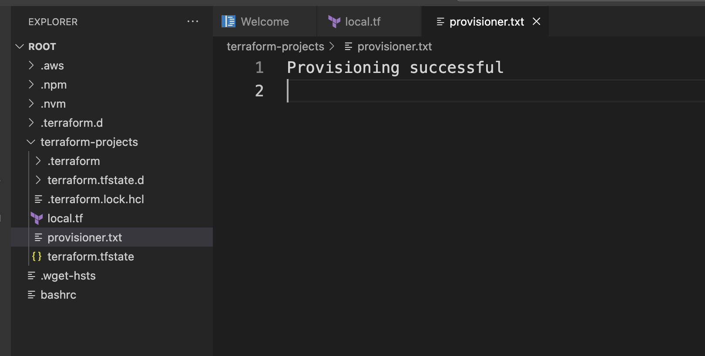
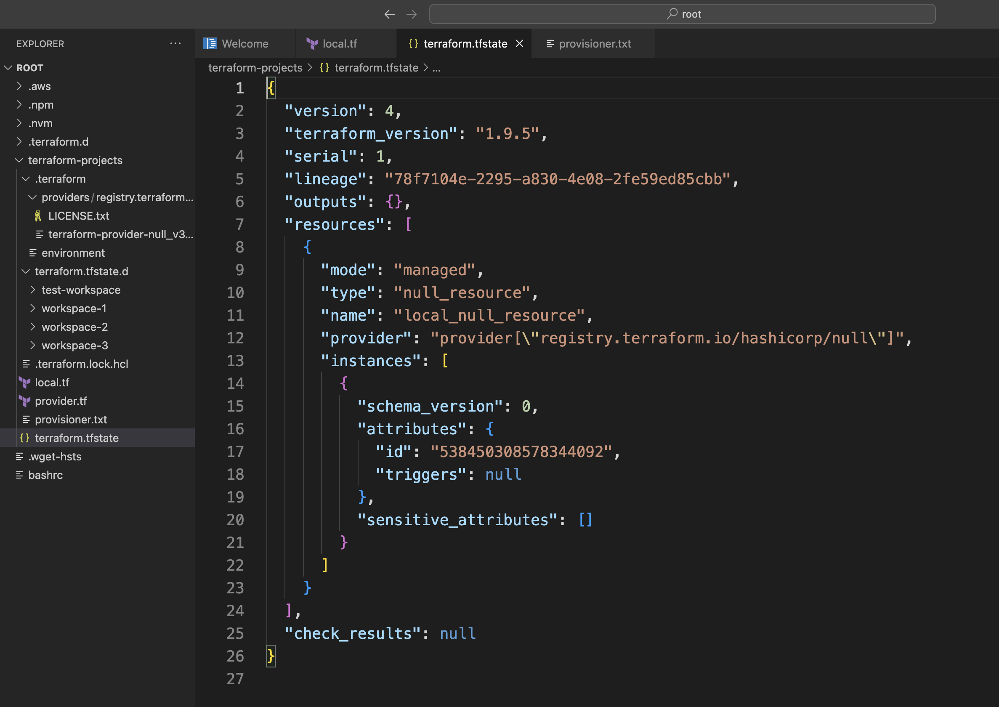
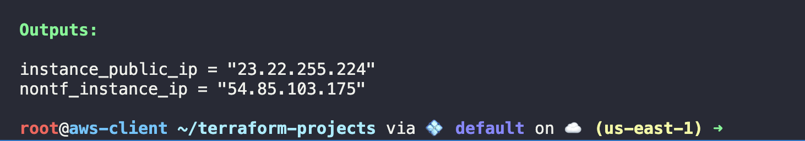

### Q1
Create a new workspace named test-workspace within the terraform-projects folder.


```bash
cd terraform-projects/
terraform workspace new test-workspace
```

#### Output
```bash
Created and switched to workspace "test-workspace"!

You're now on a new, empty workspace. Workspaces isolate their state,
so if you run "terraform plan" Terraform will not see any existing state
for this configuration.
```


### Q2
How many total workspaces have been created under terraform-projects?

```bash
terraform workspace list
```

#### Output:
```bash
default
test-workspace
workspace-1
workspace-2
* workspace-3
```

### Q3
Switch to the default workspace.
```bash
terraform workspace select dev

terraform workspace list
```

#### Output:
```bash
Switched to workspace "default".

* default
  test-workspace
  workspace-1
  workspace-2
  workspace-3
```

### Q4
Use an appropriate provisioner to create a file named `provisioner.txt` containing the text `"Provisioning successful"`. This file should be created after the creation of a `null_resource` called `local_null_resource` on the instance where Terraform apply is run.

-   Note: Name the Terraform configuration file as `local.tf.`

### Solution:
Within the terraform-projects folder, create the following `local.tf` file:

```bash
resource "null_resource" "local_null_resource" {
  provisioner "local-exec" {
    command = "echo 'Provisioning successful' > provisioner.txt"
  }
}
```

Initialize the directory:
```bash
terraform init
```

And apply the configuration:
```bash
terraform apply
```


### Q5.
Inspect the `terraform.tfstate` file that has been created after you applied the Terraform configuration in the previous task. You won't find any mention about `provisioner.txt` in the state file.

>This implies that the files created as part of the `provisioner` are not managed by Terraform. 

>Provisioners are used to execute scripts or commands on the resources after they are created, **but any files or configurations created by these scripts are not tracked by Terraform**.

#### Solution:


### Q6.
Configure an appropriate provisioner to install Nginx on an AWS EC2 instance. The EC2 instance resource is named `ec2_instance` and is declared in the pre-created `main.tf` file for you. You need to create the instance after appropriate modifications.

Include the necessary `connection` block with the following arguments:

-   **type**: `ssh`
-   **user**: `ec2-user`
-   **private_key**: Path to `p` key file
-   **host**: Public IP of the instance i.e. self-IP

The following commands, when run in succession, will install nginx on the instance:
```bash
sudo yum update -y
sudo yum install -y nginx
sudo systemctl start nginx
sudo systemctl enable nginx
```

Note: The key `my-terraform-key` has already been created for you under `/root`.

#### Solution
```bash
resource "aws_security_group" "allow_ssh_http" {
  name_prefix = "allow_ssh_http"

  ingress {
    from_port   = 22
    to_port     = 22
    protocol    = "tcp"
    cidr_blocks = ["0.0.0.0/0"]
  }

  ingress {
    from_port   = 80
    to_port     = 80
    protocol    = "tcp"
    cidr_blocks = ["0.0.0.0/0"]
  }

  egress {
    from_port   = 0
    to_port     = 0
    protocol    = "-1"
    cidr_blocks = ["0.0.0.0/0"]
  }
}

resource "aws_instance" "ec2_instance" {
  ami           = "ami-06c68f701d8090592" 
  instance_type = "t2.micro"
  key_name      = "my-terraform-key"

  vpc_security_group_ids = [aws_security_group.allow_ssh_http.id]

  associate_public_ip_address = true

  tags = {
    Name = "NginxServer"
  }

  provisioner "remote-exec" {
    connection {
      type        = "ssh"
      user        = "ec2-user" 
      private_key = file("/root/my-terraform-key.pem")
      host        = self.public_ip
    }

    inline = [
      "sudo yum update -y",
      "sudo yum install -y nginx",
      "sudo systemctl start nginx",
      "sudo systemctl enable nginx"
    ]
  }

}

output "instance_public_ip" {
  value = aws_instance.ec2_instance.public_ip
}
```
Run `terraform init` and then `terraform apply` to apply this configuration.

### Q7.
We have created a new EC2 instance tagged `CLI-Instance` using the AWS CLI.

Create a file named `data.tf` which defines an output called `nontf_instance_ip`. The value of the output should be the display name of this EC2 instance.

>Note: The instance has not been created using Terraform.

#### Solution
Create the `data.tf` file with the following contents:
```bash
data "aws_instance" "new_instance" {
  instance_id = "<ID_from_console>"
}

output "nontf_instance_ip" {
  value = data.aws_instance.new_instance.public_ip
}
```

Inspect the AWS management console for the instance ID of the instance tagged as CLI-Instance.

Then apply the file:
```bash
terraform apply
```


