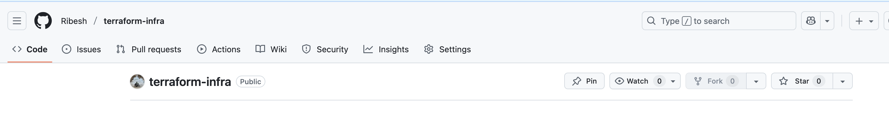
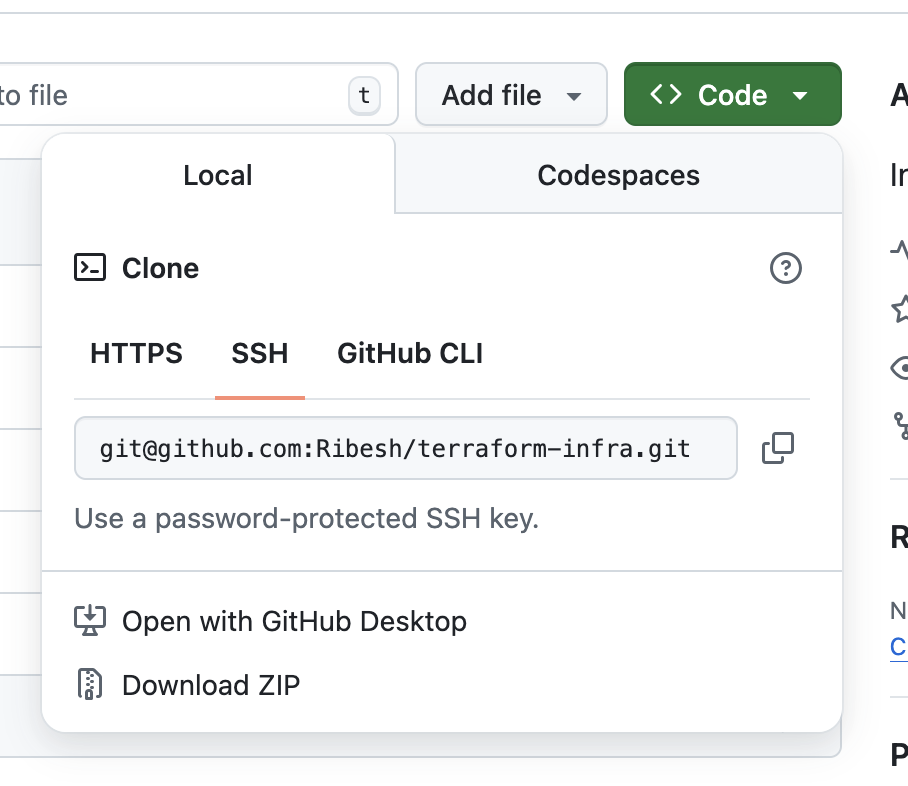
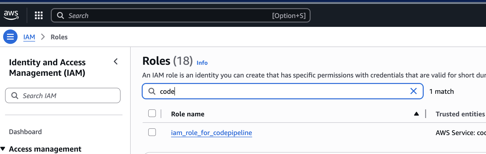
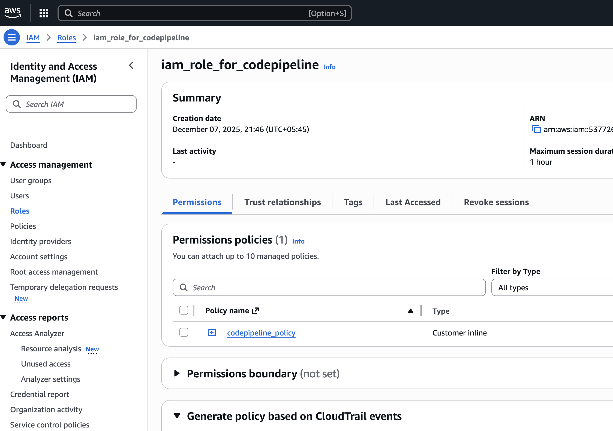
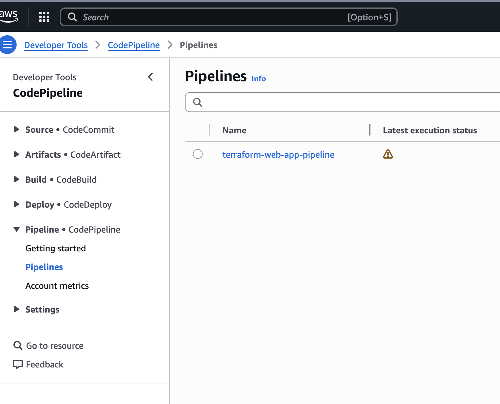
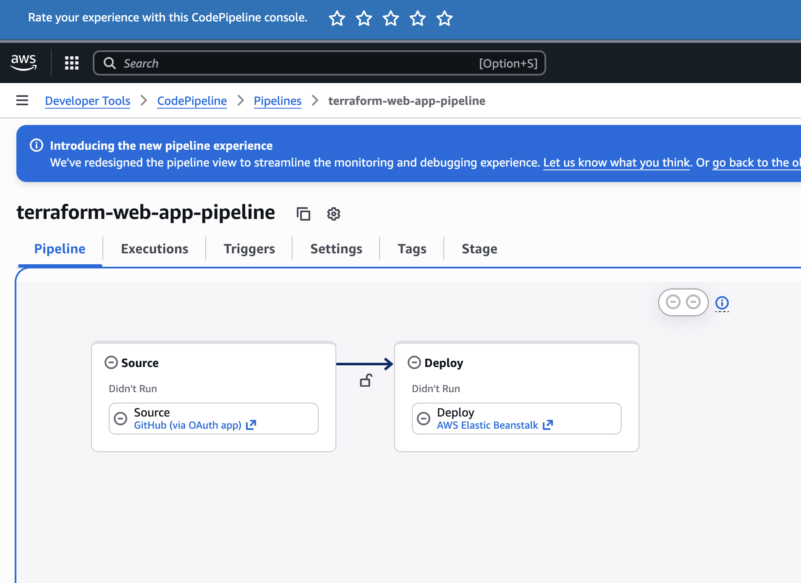
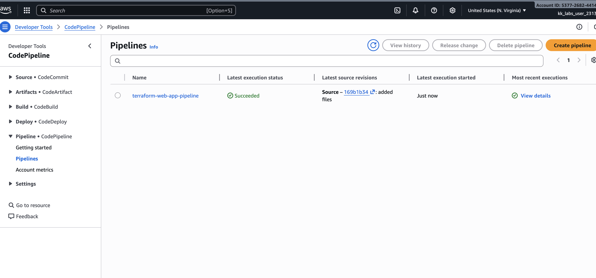
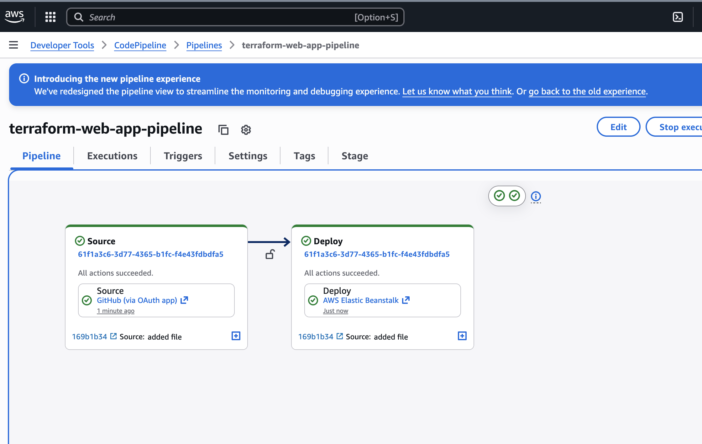
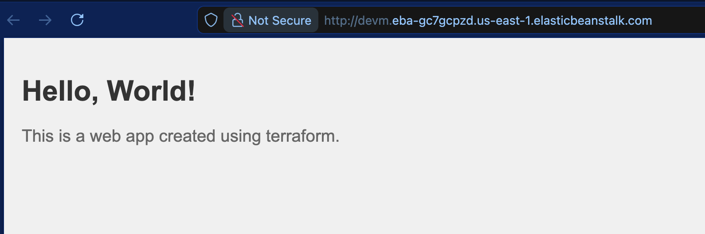

# LABS
### Step 1:
Configure following environment variables with your own GitHub account information:
```bash
vi /root/github_repo_info.json
{
    "REPO_OWNER": "your_username_here",
    "ACCESS_TOKEN": "your_access_token_here"
}
```

### Step 2:
In the `terraform-projects` folder, create a file titled `main.tf`. 
>This file should create a public GitHub repository called `terraform-infra`.

Also, declare an output called `repository_clone_url_ssh` in Terraform which holds the value of the **SSH clone URL of the repo**.

```bash
#main.tf

provider "github" {
    token = "--your--github--token----"
}

resource "github_repository" "terraform-infra-repo"{
    name = "terraform-infra"
    description = "Infrastructure repository managed by Terraform"
    visibility = "public"
    has_issues = true 
    has_wiki =  true 
}

output "repository_clone_url_ssh" {
  value = github_repository.terraform-infra-repo.ssh_clone_url
}
```

#### Commands:
```bash
terraform init
terraform plan
terraform apply
```

#### Output:
```bash
Outputs:

repository_clone_url_ssh = "git@github.com:Ribesh/terraform-infra.git"
```



### Step 3:
Clone the `terraform-infra` repository within `root` in the terminal.

The public ssh key has already been generated for you at `/root/.ssh/id_rsa.pub`. 
>Use the SSH URL from the output that you generated in the previous task.

OR
> Get it from your repository in github



#### Solution

1. Copy the public key:
    ```
    cat .ssh/id_rsa.pub
    ```
    
2.  Go to GitHub and `log in` to your account.

3.  Click on your **profile picture** in the upper-right corner.
    
    3.1.  Go to **Settings**. In the left sidebar, click on `SSH and GPG keys`.

4.  Click the `New SSH key` button. Paste your `public key` into the Key field. Add a descriptive title for the key.
    
    4.1 Click `Add SSH key`.

5.  To get the URL in your case, run the following command in the `terraform-projects` folder:
    ```bash
    terraform output -raw repository_clone_url_ssh
    ```

6.  Finally, run the clone command:
    ```
    git clone git@github.com:your_username/your_repository.git
    ```
    6.1 Enter `yes` when you receive this prompt:
    ```
    Are you sure you want to continue connecting (yes/no/[fingerprint])? yes
    ```
7. And your repository will be cloned.


### Step 4:
We have created an S3 bucket with prefix `terraform-web-app-bucket-` for you. 
>Create a zipped file for the contents of the `static-web-app` repository and upload it to this bucket.


#### Solution

1. Navigate to the `static-web-app` directory.

2. `Zip` the contents of this folder:
    ```bash
    zip ../app-v1.zip -r * .[^.]*
    ```
    
3. Now, execute the following commands from the `/root` to upload this zipped file to the `S3 bucket`:
    ```bash
    aws s3 cp app-v1.zip s3://terraform-web-app-bucket-<random_suffix>/
    ```
    >Replace the `<random_suffix>` with the exact suffix in the bucket name from the **AWS Management Console**.


### Step 5 :
We have created an application named `terraform-web-app` running on version 20 of Node.js in Elastic Beanstalk. This application needs an environment called `devm`. Execute the following commands in the terminal so that this environment is created:

```bash
cd /root;

bucket_name=$(aws s3api list-buckets --query "Buckets[?starts_with(Name, 'terraform-web-app-bucket-')].Name" --output text);

STACKS=$(aws elasticbeanstalk list-available-solution-stacks --query 'SolutionStacks' --output text);

STACKS_NEWLINE=$(echo "$STACKS" | tr "\t" "\n");

LATEST_STACK=$(echo "$STACKS_NEWLINE" | grep "64bit Amazon Linux 2023.*running Node.js 20" | sort -V | tail -n 1);

echo "$LATEST_STACK";

aws elasticbeanstalk create-environment --application-name terraform-web-app --environment-name devm --solution-stack-name "$LATEST_STACK" --version-label v1 --option-settings file://options.json;

aws elasticbeanstalk create-application-version --application-name terraform-web-app --version-label v1 --source-bundle S3Bucket="$bucket_name",S3Key=app-v1.zip
```

Then, go and analyze the application URL from the AWS Management console. The application might take some time to get deployed.

Once deployed, you should see the following message on visiting the `devm` environment domain URL:
```bash
Hello, World!
This is a simple static web app.
```
Wait for the validations to pass and then move over to the next task.

Note: Ignore the v1 version already exists error if you encounter one.


### ℹ️ (*INFO)* Step 6:
We used an `S3` bucket to deploy an application to `Elastic Beanstalk`. We will now use `AWS CodePipeline` to deploy the application to `Beanstalk` by sourcing the code from a git repository.

We will use the repository `terraform-infra` as the source repository and the `devm` environment of the `terraform-web-app` Node.js application as the deployment target.


### Step 7: 
`AWS CodePipeline` requires an `IAM service role` to be created with the necessary permissions. 
>Create a file titled `role.tf` within `terraform-projects` folder.

This file should define a role and associated policy with the following specs and permissions:

-   **Role name**: `iam_role_for_codepipeline`
-   **Policy name**: `codepipeline_policy`
-   **Service**: `codepipeline.amazonaws.com`
-   **Action**: `sts:AssumeRole`
-   **Permissions**: All permissions for `S3`, `Codecommit`, `Codebuild`, `Elastic Beanstalk`, `Cloudformation`, `AutoScaling`, `EC2` and `PassRole permission for IAM`.
-   **Resource scope**: All resources

>Create this role using the configuration you created.

#### Solution
Create the `role.tf` file with the following contents:

```
resource "aws_iam_role" "codepipeline_role" {
  name = "iam_role_for_codepipeline"

  assume_role_policy = jsonencode({
    Version = "2012-10-17"
    Statement = [
      {
        Effect = "Allow"
        Principal = {
          Service = "codepipeline.amazonaws.com"
        }
        Action = "sts:AssumeRole"
      }
    ]
  })
}

resource "aws_iam_role_policy" "codepipeline_policy" {

  name = "codepipeline_policy"
  role = aws_iam_role.codepipeline_role.id

  policy = jsonencode({
    Version = "2012-10-17"
    Statement = [
      {
        Effect = "Allow"
        Action = [
          "s3:*",
          "codecommit:*",
          "codebuild:*",
          "elasticbeanstalk:*",
          "cloudformation:*",
          "autoscaling:*",
          "ec2:*",
          "iam:PassRole"
        ]
        Resource = "*"
      }
    ]
  })
}
```
>Save the file and run `terraform apply` to apply the configuration.

#### Screenshots of IAM in AWS





### Step 8:

Finally, create a file titled `pipeline.tf` that defines the configuration for a pipeline in `AWS CodePipeline` with the following specs:

    
-   **Pipeline name**: `terraform-web-app-pipeline`
-   **Role**: `Iam _role_for_codepipeline`
-   **Artifact location**: Bucket with prefix `terraform-web-app-bucket-`
-   **Source**: GitHub repository `terraform-infra` on branch `main`
    -   Add the `repository owner name` and `personal access token` in the configuration section under source.
-   **Deploy**: **Elastic beanstalk application** `terraform-web-app` to environment `devm`
    -   Use the **Source** and **Deploy** actions for creating these stages.
    -   The source stage should create an output artifact named `source_output` which should be used by the deploy stage as `input artifact`.

>Note: Use the previously created `S3 bucket` for `artifact`.

#### Solution:
Create the file `pipeline.tf` with the following contents:
```
resource "aws_codepipeline" "terraform-web-app-pipeline" {
  name     = "terraform-web-app-pipeline"
  role_arn = aws_iam_role.codepipeline_role.arn

  artifact_store {
    location = "terraform-web-app-bucket-<random_string>"  
    type     = "S3"
  }

  stage {
    name = "Source"

    action {
      name             = "Source"
      category         = "Source"
      owner            = "ThirdParty"
      provider         = "GitHub"
      version          = "1"
      output_artifacts = ["source_output"]

      configuration = {
        Owner      = "-------<your_github_username>-------"                
        Repo       = "terraform-infra"               # Repository name
        Branch     = "main"                          # Branch name
        OAuthToken = "------<your_personal_access_token>------"          
      }
    }
  }


  stage {
    name = "Deploy"

    action {
      name             = "Deploy"
      category         = "Deploy"
      owner            = "AWS"
      provider         = "ElasticBeanstalk"
      version          = "1"
      input_artifacts  = ["source_output"]

      configuration = {
        ApplicationName = "terraform-web-app"
        EnvironmentName = "devm"
      }
    }
  }
}
```
>Replace `<random_string>` in the bucket name under artifacts section with the actual name of your bucket. 

>Also, replace `<your_github_username>` with your GitHub account username and `<your_personal_access_token>` with the personal access token that you generated earlier.

>Then save and apply the configuration:

```
terraform apply
```


### ℹ️ *(INFO)* Step 9:
Navigate to the `terraform-web-app-pipeline` from the AWS management console. You should see the pipeline failed. This happened because our repo has currently *no files* and therefore no `main` branch present.

In the subsequent tasks, we will rectify this issue and make the pipeline to work.




### Step 10:
Upload the contents of the `static-web-app` folder to the `terraform-infra` GitHub repository.

>Before pushing the files, make a minor change to the `index.html` file. Replace the following line:
```
This is a simple static web app.
```
with
```
This is a web app created using terraform.
```


#### Solution


1.  Copy the contents of the `static-web-app` folder to the `terraform-infra` repository:
    ```bash
    cp /root/static-web-app/* /root/terraform-infra/
    ```
    
2.  Edit the `index.html` file within `terraform-infra` folder:
    ```
    <!DOCTYPE html>
    <html lang="en">
    <head>
        <meta charset="UTF-8">
        <meta name="viewport" content="width=device-width, initial-scale=1.0">
        <title>Static Demo App</title>
        <link rel="stylesheet" href="style.css">
    </head>
    <body>
        <h1>Hello, World!</h1>
        <p>This is a web app created using terraform.</p>
        <script src="app.js"></script>
    </body>
    </html>
    ```
    
3.  Run the `git status` command and you should see an output displaying all the newly added files.

4.  Run the following commands to push the changes to main branch:
    ```
    git add .
    git commit -m "Deploying application via pipeline"
    git push origin main
    ```

### ℹ️ *(INFO)* Step 11:
Navigate to the `terraform-web-app-pipeline` from the AWS management console. 
>Wait for some time, refresh the pipeline and you should see the pipeline running and succeeding.

Go to the **Elastic beanstalk application page** and check the domain URL for the `terraform-web-app application`. You should see the updated message on the UI.





