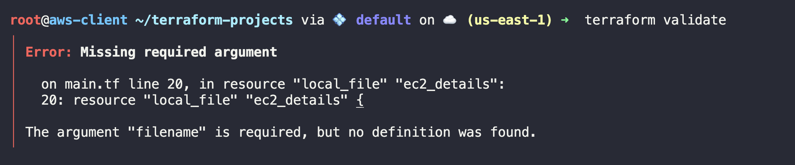
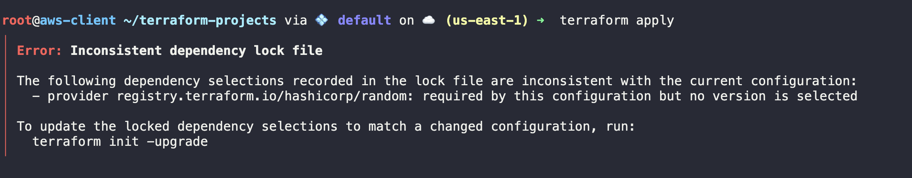
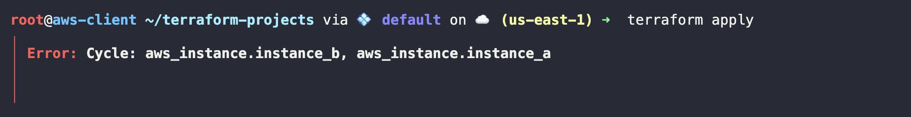

# LABS

## Step 1:
We have created a `main.tf` file that defines a resource block for the creation of an `EC2 instance`. However, the instance is not being created.

Identify and fix the error in the repository files.

Note: `provider.tf` has already been created for you in the folder.

The AWS credentials file lies in the `/root/.aws` folder.
```
#provider.hf
provider "aws" {
  region     = "us-east-1"
  access_key = ""
  secret_key = ""
}
```

#### Solution

1. Navigate to the `terraform-projects` folder and run `terraform apply`.

    You should see an error like this:
    ```
    Error: retrieving credentials: static credentials are empty
    │ 
    │   with provider["registry.terraform.io/hashicorp/aws"],
    │   on provider.tf line 1, in provider "aws":
    │    1: provider "aws" {
    ```

2.  Inspect the `provider.tf` file and you should see that the secret_key is missing. Extract the value of `secret_key` from the file and add it to the `provider.tf` file:
    ```
    cat /root/.aws/credentials
    ```

3.  Save the provider config and run the apply command within the `terraform-projects` folder:
    ```
    terraform apply
    ```

##### Output:
```bash
Apply complete! Resources: 1 added, 0 changed, 0 destroyed.

Outputs:

instance_id = "i-0a6b05f9ca45d1412"
instance_public_ip = "18.209.57.111"
```


### Step 2:
We have added another resource block to the `main.tf` file. This creates a file titled `ec2_details.txt` in the same folder with the details of the EC2 instance that has been created.

Check whether the syntax and semantics of the block is correct. Fix, if not.

Note: Do not apply the configuration yet.

```
resource "local_file" "ec2_details" {
  content  = "New EC2 instance created with ID: ${aws_instance.ec2-instance.id} and IP: ${aws_instance.ec2-instance.public_ip}"
}
```

#### Solution
In the `terraform-projects` directory, run the `terraform validate` command and you should see an error like this:
```
Error: Missing required argument
│ 
│   on main.tf line 20, in resource "local_file" "ec2_details":
│   20: resource "local_file" "ec2_details" {
│ 
│ The argument "filename" is required, but no
│ definition was found.
```
>`filename` is a mandatory argument which is missing from the `ec2_details resource block`.



Add the argument with the correct `filename` and save the file:
```
resource "local_file" "ec2_details" {
  filename = "ec2_details.txt"
  content  = "New EC2 instance created with ID: ${aws_instance.ec2-instance.id} and IP: ${aws_instance.ec2-instance.public_ip}"
}
```

### Step 3:
Now, set the Terraform `log level` to `DEBUG` and ensure that the logs are redirected to the file `/tmp/terraform-project.log` before applying the configuration. 

#### Solutions:

1.  Navigate to the `terraform-projects` folder and run the following commands to `export` the Terraform variables:
    ```
    export TF_LOG=DEBUG
    export TF_LOG_PATH="/tmp/terraform-project.log"
    ```
    
2.  Now, apply the configuration:
    ```
    terraform apply
    ```
    >Note: Run the command in the **same subshell** where you exported the variables.

3.  To view the debug logs. 
    ```
    cat /tmp/terraform-project.log
    ```

### Step 4:
We have added yet another resource block to the `main.tf` file. However, we are unable to apply the configuration. Fix the issue and create the resource.

```
resource "random_pet" "my_pet" {
   length = 3
   prefix = "Mr."
}
```

#### Solution:
Run the `terraform apply` command within the `terraform-projects` folder. You should see an output like this:
```
Error: Inconsistent dependency lock file
│ 
│ The following dependency selections recorded in the lock file are
│ inconsistent with the current configuration:
│   - provider registry.terraform.io/hashicorp/random: required by this configuration but no version is selected
│ 
│ To update the locked dependency selections to match a changed
│ configuration, run:
│   terraform init -upgrade
```


This indicates that the `.terraform.lock.hcl` file doesn't have this new provider `random_pet` defined. To update the file, run the following command:
```
terraform init -upgrade
```
>Then, run `terraform apply` to create the resource.


### Step 5:
We have added resource blocks in the `main.tf` file for you which create two new EC2 instances - `instance_a` and `instance_b`.

The userdata for `instance_b` creates a file at `/var/www/html/index.html` in the instance. This file contains the IP address of `instance_a` after it has been created.

However, there are some issues with this file and the instances are not being created.

Fix this issue and create the instances.

```
resource "aws_instance" "instance_a" {
  ami           = "ami-06c68f701d8090592"  
  instance_type = "t2.micro"
  tags = {
    Name = "InstanceA"
  }
  
  key_name = "my-key-pair" 

  user_data = <<EOF
#!/bin/bash
mkdir -p /var/www/html/
echo "Instance B Public IP: ${aws_instance.instance_b.public_ip}" > /var/www/html/index.html
EOF

}

resource "aws_instance" "instance_b" {
  ami           = "ami-06c68f701d8090592"  
  instance_type = "t2.micro"
  tags = {
    Name = "InstanceB"
  }

  key_name = "my-key-pair"

  user_data = <<EOF
#!/bin/bash
mkdir -p /var/www/html/
echo "Instance A Public IP: ${aws_instance.instance_a.public_ip}" > /var/www/html/index.html
EOF

}
```


#### Solutions:
Run `terraform apply` command in the `terraform-projects` folder and you should see an error like this:
```
│ Error: Cycle: aws_instance.instance_b, aws_instance.instance_a
```



Erroneously another user_data section has been added to `instance_a` block which references IP address of `instance_b` and creates a dependency error.

Remove the `user_data` for `instance_a` and apply the configuration.

```
resource "aws_instance" "instance_a" {
  ami           = "ami-06c68f701d8090592"  
  instance_type = "t2.micro"
  tags = {
    Name = "InstanceA"
  }
  
  key_name = "my-key-pair" 

}

resource "aws_instance" "instance_b" {
  ami           = "ami-06c68f701d8090592"  
  instance_type = "t2.micro"
  tags = {
    Name = "InstanceB"
  }

  key_name = "my-key-pair"

  user_data = <<EOF
#!/bin/bash
mkdir -p /var/www/html/
echo "Instance A Public IP: ${aws_instance.instance_a.public_ip}" > /var/www/html/index.html
EOF

}
```
> Run `terraform apply`