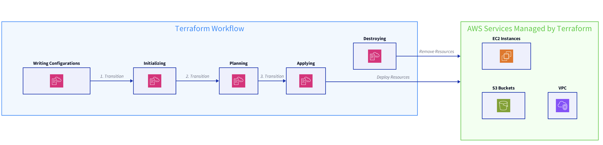

# Terraform
## What is Terraform?

>Terraform is an **open-source infrastructure as code (IaC) tool** developed by **HashiCorp** that allows users to define and provision infrastructure using a **high-level configuration language**.

It is particularly powerful in managing cloud services and infrastructure, with `Amazon Web Services (AWS)` being one of the most popular cloud platforms supported by Terraform.

## Benefits of Infrastructure as Code (IaC)
>Before diving into `Terraform` and its functionalities, let's understand the concept of `Infrastructure as Code (IaC)` and its benefits.

### What is Infrastructure as Code?
>Infrastructure as Code is a key DevOps practice that **involves managing and provisioning computing infrastructure** through **machine-readable definition files**, rather than physical hardware configuration or interactive configuration tools.

### Benefits of IaC
1. **Automation**: Automates the deployment of infrastructure, reducing manual processes and the potential for human errors.    
    -   **Don't have to manually create same resources everytime**

2. **Consistency**: Ensures consistent environments are created every time, eliminating the **"it works on my machine" problem.**
    -   Less chances of human error

3. **Version Control**: Infrastructure can be **version-controlled**, *allowing for easy tracking of changes, rollbacks, and collaboration among teams*.

4. **Cost Savings**: Reduces the time and resources required to manage infrastructure, leading to cost savings.

## Terraform Workflow
>The Terraform workflow consists of several key steps:

1. `Create`: Define infrastructure using Terraform's configuration language in `.tf` files.
    -   Firstly create a `.tf` file then run `terraform create` in the same folder consisting of the `.tf` file

2. `Plan`: Execute terraform plan to preview the changes Terraform will make to match the desired state.

3. `Apply`: Run terraform apply to apply the changes to the infrastructure.

    ```bash
    # Initialize Terraform
    terraform init

    # Plan infrastructure changes
    terraform plan

    # Apply changes
    terraform apply
    ```

4.  `Destroy`: When no longer needed, infrastructure can be cleanly removed with `terrafrom destroy`.

## Managing AWS Services with Terraform
> `Terraform` can manage a wide range of AWS services, from simple compute instances to complex network configurations. Here's an overview of how Terraform interacts with AWS:



### AWS Provider
`Terraform` uses providers to interact with cloud services. The AWS provider is used to manage **AWS resources**. You need to configure the provider with the necessary credentials before managing AWS services.

```bash
provider "aws" {
  region     = "us-west-1"
  access_key = "your_access_key"
  secret_key = "your_secret_key"
}
```

#### Example: Provisioning an EC2 Instance
Let's look at a simple example of using Terraform to provision an EC2 instance:
```bash
resource "aws_instance" "example" {
  ami           = "ami-01b799c439fd5516a"
  instance_type = "t2.micro"
}
```

### AWS Services Managed by Terraform
Terraform can manage a broad spectrum of AWS services, including but not limited to:

-   EC2 Instances
-   S3 Buckets
-   VPC and Networking Resources
-   IAM Policies and Roles
-   DynamoDB Tables
-   Lambda Functions

## Terraform Configuration Language
Terraform uses its own configuration language, HashiCorp Configuration Language (HCL), designed to describe infrastructure in a declarative manner.

### Basics of HCL
-   Resources: The primary construct in an HCL file, resources represent a piece of infrastructure, such as an EC2 instance or an S3 bucket.
-   Providers: Specify the cloud service (e.g., AWS) and provide necessary credentials.
-   Variables: Allow customization of Terraform configurations without altering the main configuration.

```bash
variable "instance_type" {
  description = "EC2 instance type"
  default     = "t2.micro"
}

resource "aws_instance" "my_instance" {
  ami           = "ami-01b799c439fd5516a"
  instance_type = var.instance_type
}
```


### Structure of a Terraform Configuration File
A Terraform configuration file typically includes:

- **Provider Configuration:** Specifies the cloud provider and credentials
- **Resource Definitions:** Define the infrastructure components
- **Variables:** Optional variables to customize the configuration
- **Outputs:** Specify output values that can be useful for other configurations or providing information to the user


