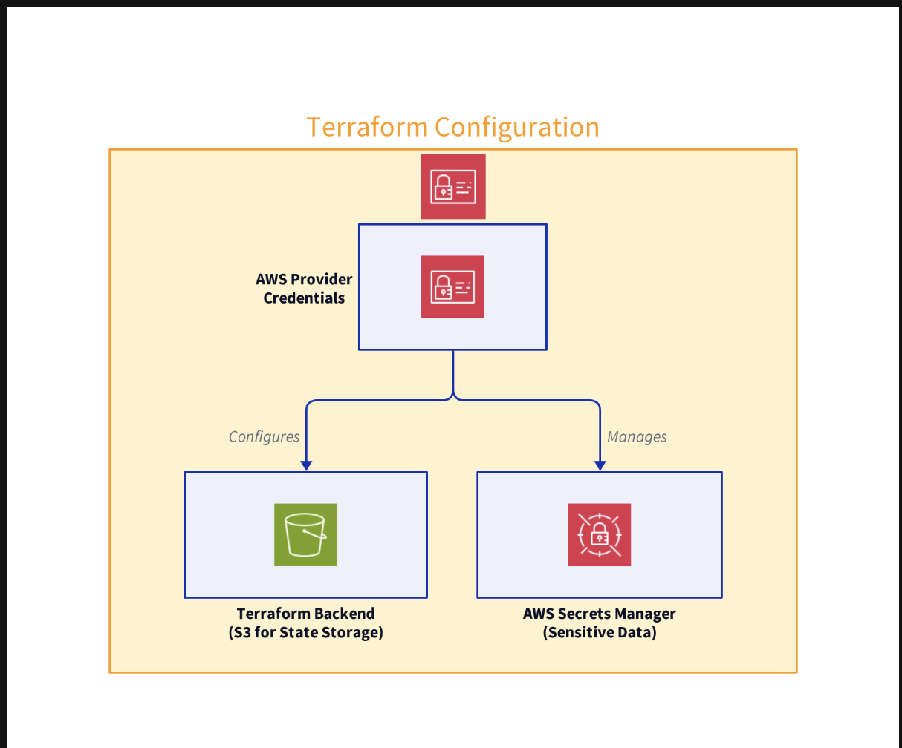

# Setting Up Terraform with AWS

## Configuring AWS Provider Credentials
> Before you can use `Terraform` with AWS, you need to configure your AWS provider credentials. 
- This allows `Terraform` to interact with your **AWS account to create, update, and delete resources**.

### Creating an IAM User
1. Log in to your **AWS Management Console**.
2. Navigate to the **Identity and Access Management (IAM)** page.
3. Create a **new IAM user** with programmatic access. This will provide you with an `access key ID` and a `secret access key`.

## Configuring the AWS Provider in Terraform
```bash
provider "aws" {
  region     = "us-east-1"
  access_key = "your_access_key_here"
  secret_key = "your_secret_key_here"
}
```

>**Note:** It's recommended to use environment variables (`AWS_ACCESS_KEY_ID` and `AWS_SECRET_ACCESS_KEY`) for your keys to keep them secure.

## Basic Structure of a Terraform Project
A typical **Terraform** project contains the following files:
-   `main.tf`: This file contains the main set of configuration code.
-   `variables.tf`: Here, you can declare variables to make your configuration more dynamic and reusable.
-   `outputs.tf`: This file is used to define outputs from your Terraform state.

    ```bash
    # main.tf
    resource "aws_s3_bucket" "my_bucket" {
    bucket = "my-unique-bucket-name"
    }

    # variables.tf
    variable "region" {
    description = "The AWS region"
    default     = "us-east-1"
    }

    # outputs.tf
    output "bucket_name" {
    value = aws_s3_bucket.my_bucket.id
    }
    ```

## Backend Configurations for Remote State Storage
Terraform stores state information about your managed infrastructure and configuration. This state can be stored remotely, which is essential for team collaboration and for keeping sensitive information secure.

### Configuring an S3 Backend
```bash
terraform {
  backend "s3" {
    bucket = "my-terraform-state-bucket"
    key    = "state"
    region = "us-east-1"
  }
}
```

>This configuration stores the Terraform state in an S3 bucket, allowing it to be shared among a team and providing a backup of this critical information.


## Managing Sensitive Data with Terraform
Sensitive data, such as passwords or access keys, should never be hard-coded into your Terraform configuration files.

### Using AWS Secrets Manager
AWS Secrets Manager helps you protect access to your applications, services, and IT resources without the upfront cost and complexity of managing your own infrastructure for secret management.

#### Integrating AWS Secrets Manager with Terraform

```bash
data "aws_secretsmanager_secret_version" "my_secret" {
  secret_id = "my_secret_name"
}

resource "aws_db_instance" "my_database" {
  # other configuration...
  password = data.aws_secretsmanager_secret_version.my_secret.secret_string
}
```


## Architecture Diagram
 


