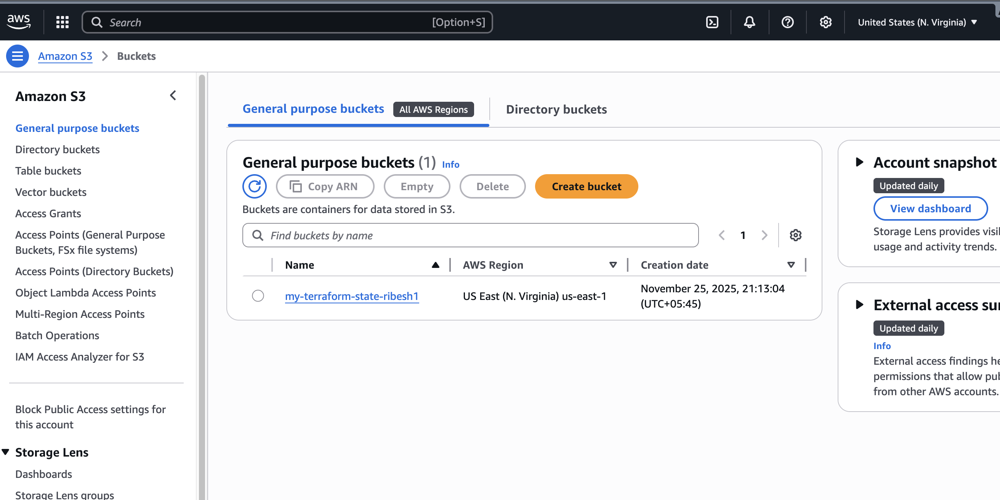
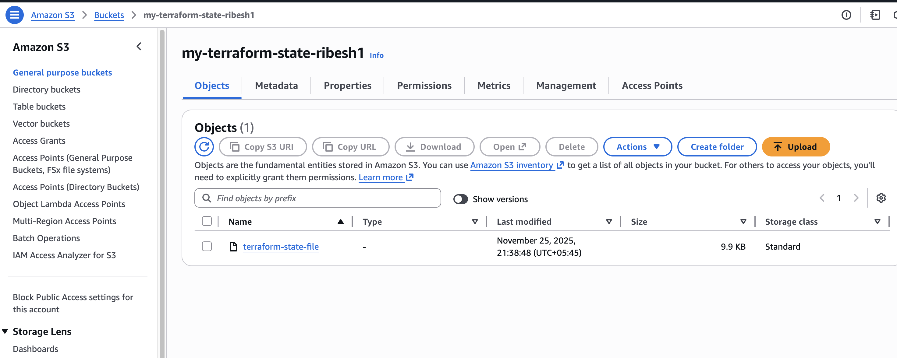
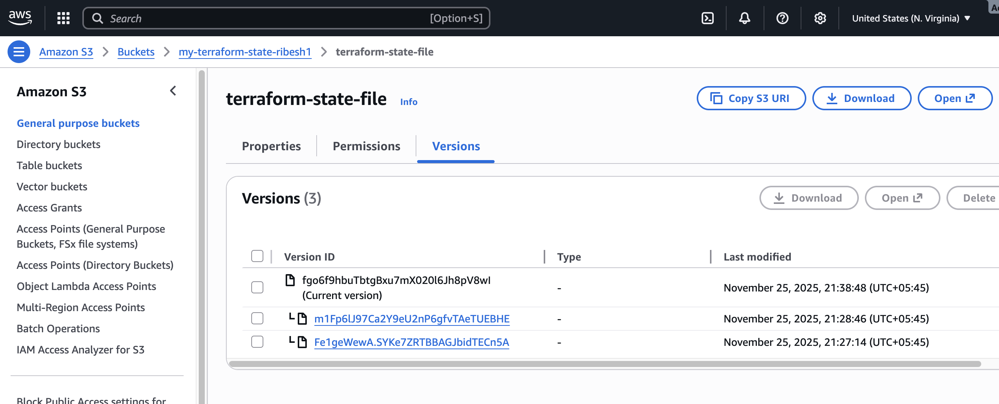
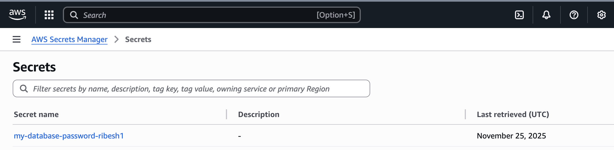
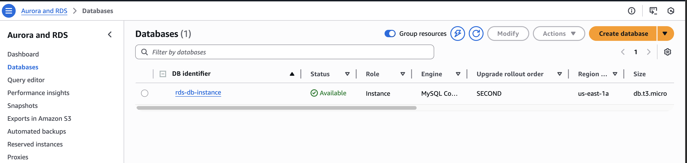

## Create `provider.tf` file
```bash
provider "aws"{
    region = ""
    access_key = ""
    secret_key = ""
}
```

## Create `main.tf` file
```bash
resource "aws_s3_bucket" "terraforn_state" {
    bucket = "my-terraform-state-ribesh1"
}

resource "aws_s3_bucket_versioning" "versioning" {
    bucket = aws_s3_bucket.terraforn_state.id

    versioning_configuration{
        status = "Enabled"
    }
}

resource "aws_s3_bucket_public_access_block" "block_public_access" {
    bucket = aws_s3_bucket.terraforn_state.id

    block_public_acls = true 
    ignore_public_acls = true 
    block_public_policy = true 
    restrict_public_buckets = true
}
```

## Run terraform commands
```bash
terraform init
terraform plan
terraform apply
```

## Create a `backend.tf` file for S3 Backend
```bash
terraform {
    backend "s3" {
      bucket = "my-terraform-state-ribesh1"
      region = "us-east-1"
      key = "terraform-state-file"
    }
    
}
```

## Create a password in AWS SecretsManager using CLI
```bash
aws secretsmanager create-secret --name my-database-password-ribesh --secret-string "YourSecurePassword"
```


## Create a RDS instance

> Append the `main.tf` to create the RDS instnace and fetch the `db_password` from **AWS Secrets Manager**
```bash
data "aws_secretsmanager_secret_version" "database_password"{
    secret_id = "my-database-password-ribesh1"
}

resource "aws_db_instance" "my_secret_db" {
    identifier = "rds-db-instance"
    allocated_storage = 20
    storage_type = "gp2"
    engine = "mysql"
    engine_version = "8.0.43"
    instance_class = "db.t3.micro"
    username = "admin"
    password = data.aws_secretsmanager_secret_version.database_password.secret_string
}
```


## Run terraform commands
```bash
terraform init
terraform plan
terraform apply
```


## Screenshots

S3


terraform-state-file in S3 bucket


terraform-state-file's different versions


---

AWS Secrets Manager


---

RDS


---