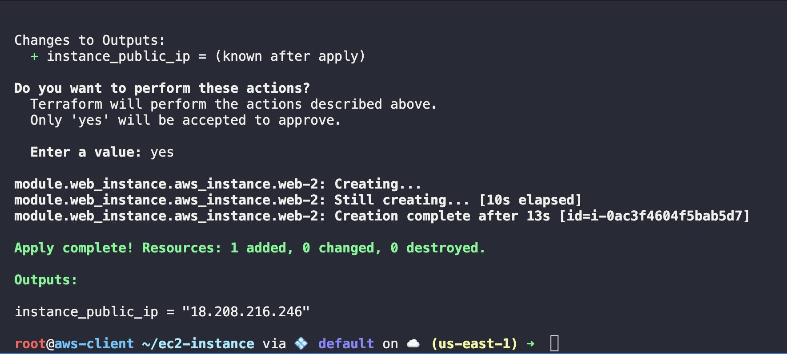

### 1. Create the `provider.tf` file in `terraform-projects` directory
```bash
provider "aws" {
    region = "******"
    access_key = "*******"
    secret_key = "******"
}
```

### 2. Create the `vpc.tf` file in `terraform-projects `directory

```bash
resource "aws_vpc" "KK_VPC"{
    cidr_block = "10.0.0.0/16"
}
```

### 2.1 Run Terraform Commands

```bash
terraform init
terraform plan
terraform apply
```

### 3. Create `variables.tf` in `terraform-projects` directory

```bash
variable "instance_type" {
    description = "EC2 Instance Type"
    default = "t2.micro"
}

variable "ami" {
    description = "EC2 AMI ID"
    default = "ami-01b799c439fd5516a"
}
```


### 4. Create `main.tf` in `terraform-projects` directory
```bash
resource "aws_instance" "web" {
    ami = var.ami
    instance_type = var.instance_type
}
```


### 4.1 Run Terraform Commands

```bash
terraform init
terraform plan
terraform apply
```

### 5. Create `outputs.tf` in `terraform-projects` directory

```bash
output "web_instance_public_ip" {
    value = aws_instance.web.public_ip
}
```

### 5.1 Run Terraform Commands

```bash
terraform apply
```

Output:
`instance_public-up = "xx.xx.xx.xx"`

