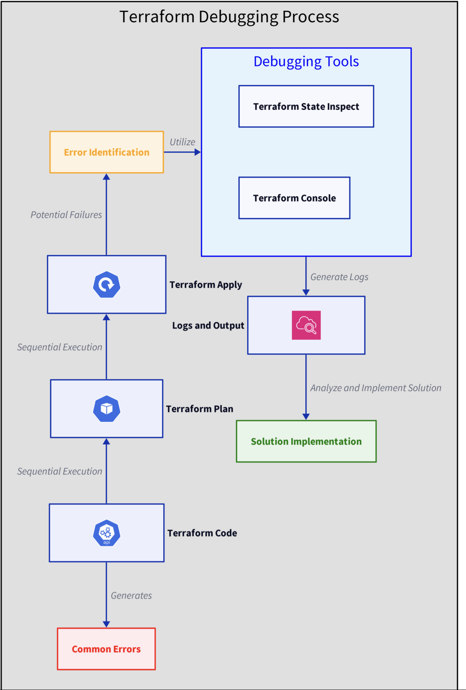

# 📇 Troubleshooting and Debugging Terraform Configurations

>In this guide, we will explore common issues encountered when working on `AWS` with `Terraform`, a popular infrastructure as code tool, and how to effectively troubleshoot and debug these problems. 

>Whether you're a beginner or have some experience with `Terraform`, understanding how to diagnose and resolve issues is crucial for maintaining efficient and reliable infrastructure deployments.

## 🧐 Understanding Terraform Errors
>Terraform errors can often appear *daunting* at first glance, but they generally fall into a few categories that can guide us towards *resolution*.
### Syntax Errors

**Syntax errors** occur when the code doesn't follow Terraform's expected format. These are often the easiest to fix but can be frustrating if not spotted early.

#### Example:
```
resource "aws_s3_bucket" "example" {
  name = "my-unique-bucket-name"
  acl = "private"
}
```
>A missing equals sign `=` after `acl` would result in a syntax error.


### Authentication Issues

**Authentication issues** arise when `Terraform` cannot properly authenticate with the cloud provider. This could be due to missing credentials or incorrect permission settings.

#### Example:
```
Error: No valid credential sources found for AWS Provider.
```
>This error indicates that `Terraform` cannot find your `AWS credentials`.

### Resource Errors

**Resource errors** happen when there's an issue with the **infrastructure** you're trying to manage, such as trying to create a resource that already exists.

#### Example:
```
Error: A resource with the ID "my-unique-bucket-name" already exists.
```
>This error suggests that the `S3 bucket` you're trying to create already exists.


## ⏳ Debugging Techniques

>Debugging in `Terraform` involves a combination of reading error outputs, understanding the state of your infrastructure, and using **Terraform's built-in tools**



### Reading Terraform Plan Output

>Before applying changes, always run `terraform plan`. It provides a preview of the actions Terraform will take, which can help identify potential issues early.
```
terraform plan
```

### Using `TF_LOG`

Terraform has a detailed logging mechanism that can be enabled by setting the `TF_LOG` environment variable. It can be set to `DEBUG`, `INFO`, `WARN`, `ERROR`, or `TRACE`.

```
export TF_LOG=DEBUG
terraform apply
```
>This command will output a lot of `debug` information, which can be useful for pinpointing the source of an issue.

### Terraform State Inspection

`Terraform` maintains the **state of your managed infrastructure**. Inspecting the state can help understand the current configuration and identify discrepancies.
```
terraform state list
```
>This command lists all the resources in your current state.


### Using `terraform console`

The `terraform console` command allows you to interact with the state and perform real-time evaluations of expressions, which can be useful for debugging.
```
terraform console
> aws_s3_bucket.example.arn
```
>This command would output the `ARN` of the specified `S3 bucket` if it exists.

## 🤓 Common Solutions
### Syntax Errors

For *syntax errors*, always refer to the Terraform documentation for the correct format. 
>Tools like `terraform validate` can help catch these errors early.
```
terraform validate
```

### Authentication Issues

>Ensure your cloud provider credentials are correctly configured. 

For AWS, for example, this might involve setting up the `AWS CLI` or configuring `environment variables`.
```
aws configure
```

### Resource Errors

>For *resource conflicts*, ensure that the resources you're trying to create *do not already exist*, or use `terraform import` to bring an existing resource into **Terraform management**.
```
terraform import aws_s3_bucket.example my-existing-bucket
```

## 🎉 Conclusion

Debugging Terraform configurations requires patience and a systematic approach. 

>By understanding common error types, utilizing Terraform's debugging tools, and applying general troubleshooting strategies, you can resolve most issues encountered during Terraform development. 

>Remember, the Terraform community and documentation are valuable resources when you're stuck.


## Q&A
### Q1.

Which command is used to check the syntax of your Terraform files?

> `terraform validate`


### Q2.
Which `TF_LOG` level would you set to get the most detailed logging information for debugging?

> TRACE

### Q3.
When encountering an authentication issue with `AWS`, what is the first thing you should check?

> AWS credentials configurations


### Q4.
Which log level would show general information including warnings about deprecated features and hints for fixing specific errors?

> WARN


### Q5.
To diagnose Terraform performance issues, which `TF_LOG` level might **you avoid due** to its verbose output?

> TRACE


### Q6.
Which `TF_LOG` level is recommended for getting concise but informative messages necessary for common debugging?

> INFO

### Q7.
When you only need to view errors that Terraform encounters during execution, which `TF_LOG` level should you use?

> ERROR


### Q8.
Which environment variable should you set to specify the path where Terraform logs will be written?

> TF_LOG_PATH

is the variable that you should set to specify the path where the logs will be written.